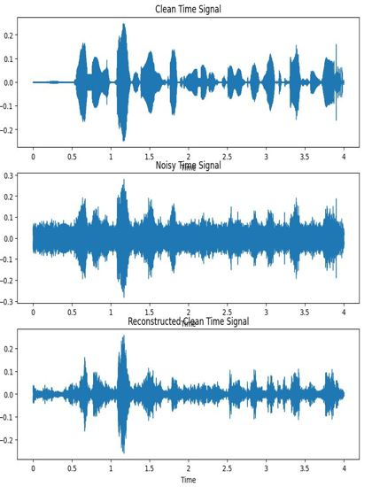
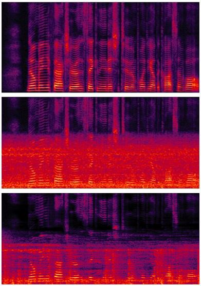

# SpeechEnhancement; MMSE-STSA
### MMSE-STSA: Minimum Mean squared error - Short-Time Spectral Amplitude

### overview:
- Input: noisy signal (The assumption that signal is made by adding the noise and clean speech)
- process
         - 1. Use STFT (short-time fourier transform) to obtain real, imaginary values from the F-T domain and then calculate magnitude and phase.
         - 2. We have to estimate the noise power with gamma function & bessel function from noisy signal. (In this code, I used MS (*minimum statistics*) method to estimate noise power)
             - 2-1. In this process, *a priori SNR* and *a posteriori SNR* are obtained, and these two parameters are closely related to MMSE.
         - 3. Use step 2 to calculate the gain function and multiply it by the magnitude of the noisy signal.
         - 4. We can get the estimated signal. (What we want to get.)
- Output: clean speech (Estimated from noisy signal)

## Results
Time domain | Frequency domain 
:---: | :---: |
 |  |

## References
[1] Y. Ephraim and D. Malah, "Speech enhancement using a minimum-mean square error short-time spectral amplitude estimator," IEEE Trans Acoustics Speech and Signal Processing, VOL. 32(6):1109-1121, Dec 1984.(https://ieeexplore.ieee.org/stamp/stamp.jsp?arnumber=1164453)
